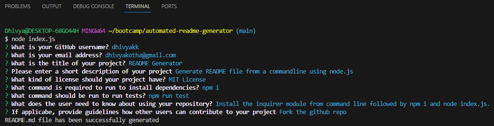
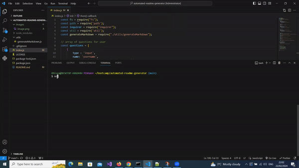

# README Generator

## About

The README generator application is aimed to generate a professional README file based on the answers provided to a series of questions from the command line using Node.js

Inquirer.js strives to be an easily embeddable and beautiful command line interface for Node.js . It eases the process of providing
error feedback, asking question, parsing input, validating answers and managing hierarchical prompts.

Use inquirer from your command line to answer questions about your project. The response provided to the questions are recorded under appropriate
sections in the README.md file generated.

## Table of Contents
  * [Installation](#installation)
  * [Usage](#usage)
  * [License](#license)
  * [Tests](#tests)

## Installation 

The user should clone the repository from GitHub and download Node. This application also requires a file system and inquirer module. 

From the command line,  use the command to install inquirer.js. 
step 1: npm i inquirer@6.3.1 . Please use the appropriate version
step 2: npm i
 
## Usage 

step 3: node index.js to run the application.

When you run node index.js, the application uses the inquirer package to prompt you in the command line with a series of questions about your GitHub and about your project to receive user response. The responses are then presented under different sections of a README.md file (this project creates a README-Generate.md file in root directory).

A short clip of the demonstration of how the application works is shown below.

 

or view link here [Screencastify](images/READMEGenerator.mp4)

## License 
  
Licensed under MIT License.

## Tests

Run the command npm test in the command line terminal to run test for the project.

